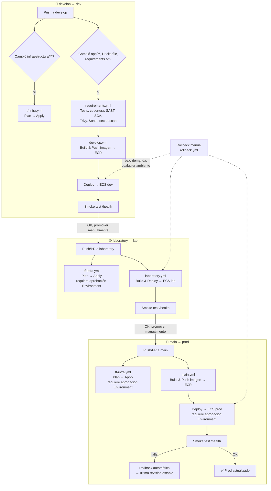

# Microservicio Echo

Microservicio en **FastAPI** desplegado en **AWS ECS Fargate**, con infraestructura como código en **Terraform** y pipelines de CI/CD en **GitHub Actions** autenticados vía **OIDC** (sin credenciales estáticas).

## Arquitectura

```
GitHub Actions ──(OIDC)──▶ IAM Role ──▶ ECR (build & push imagen)
                                    └─▶ ECS Fargate ──▶ ALB ──▶ Internet
                                    └─▶ S3 + DynamoDB (Terraform state/locks)
```

- **App**: FastAPI, dos endpoints (`/health`, `/consecutivo`), corre en ECS Fargate detrás de un Application Load Balancer.
- **Infra**: Terraform, un módulo por componente (`networking`, `alb`, `ecr`, `ecs`), un directorio por ambiente (`dev`, `lab`, `prod`).
- **Estado de Terraform**: bucket S3 + tabla DynamoDB para locking, provisionados una única vez por el workflow de bootstrap.
- **Autenticación AWS**: OIDC de GitHub Actions contra un IAM Role — no se usan access keys estáticas en el día a día.

## Estructura del repositorio

```
app/                          # Código de la aplicación (FastAPI)
├── main.py                   # Endpoints: /health, /consecutivo
└── models.py                 # Modelos Pydantic + contador en memoria

tests/                        # Suite de tests (pytest)
infraestructura/
├── bootstrap/                # Recursos base: S3, DynamoDB, OIDC provider, IAM Role (una sola vez)
├── environments/{dev,lab,prod}/  # Un stack de Terraform por ambiente
└── modules/{networking,alb,ecr,ecs}/  # Módulos reutilizables

.github/workflows/
├── bootstrap.yml              # Provisiona la infra base (manual, una sola vez)
├── tf-infra.yml                # Plan/Apply de Terraform por ambiente (dev/lab/prod)
├── develop.yml                 # Build & Deploy → dev (push a develop)
├── laboratory.yml              # Build & Deploy → lab (push a laboratory)
├── main.yml                    # Build & Deploy → prod (push a main) + rollback automático
├── rollback.yml                 # Rollback manual bajo demanda a cualquier ambiente
└── requirements.yml            # Tests, cobertura, linting y seguridad (SAST/SCA/secret scan)

Dockerfile
requirements.txt / requirements-test.txt
sonar-project.properties
.trivyignore
```

## Flujo CI/CD



Todos los jobs que hablan con AWS se autentican vía **OIDC** (`aws-actions/configure-aws-credentials`), asumiendo el rol `AWS_OIDC_ROLE_ARN` — no hay credenciales estáticas en el flujo normal, solo durante el bootstrap inicial.

## Ambientes y estrategia de ramas

| Rama         | Ambiente | Despliegue de infra (`tf-infra.yml`) | Despliegue de app       |
|--------------|----------|----------------------------------------|--------------------------|
| `develop`    | `dev`    | Automático en push a `infraestructura/**` | Automático en push a `app/**`, `Dockerfile`, `requirements.txt` |
| `laboratory` | `lab`    | Automático (requiere aprobación de Environment) | Automático (requiere aprobación) |
| `main`       | `prod`   | Automático (requiere aprobación de Environment) | Automático (requiere aprobación) + rollback automático si falla |

El flujo de promoción es `develop → laboratory → main`.

## Primeros pasos (setup de infraestructura, una sola vez)

1. **Credenciales AWS estáticas temporales**: crea un usuario IAM con permisos de administrador y guarda sus llaves como secrets del repo:
   - `AWS_ACCESS_KEY_ID`
   - `AWS_SECRET_ACCESS_KEY`
2. **Correr el bootstrap**: Actions → **Bootstrap — Infraestructura Base** → *Run workflow*, escribe `CREAR` en el input de confirmación. Esto crea:
   - Bucket S3 + tabla DynamoDB (estado de Terraform)
   - OIDC Provider de GitHub en IAM
   - IAM Role que usarán los pipelines (`microservicio-echo-github-actions`)
3. **Guardar el rol como secret**: copia el ARN que aparece en el resumen del workflow y créalo como secret **`AWS_OIDC_ROLE_ARN`**.
4. **Eliminar las credenciales estáticas** (`AWS_ACCESS_KEY_ID` / `AWS_SECRET_ACCESS_KEY`) — a partir de aquí todo se autentica por OIDC.
5. **Provisionar cada ambiente**: Actions → **Terraform Infrastructure** → *Run workflow* → elige `environment` (`dev`/`lab`/`prod`) y `action: apply`. Esto crea el cluster ECS, ALB y repositorio ECR de ese ambiente.

## Desarrollo local

```bash
python3.12 -m venv .venv
source .venv/bin/activate
pip install -r requirements-test.txt

# Levantar la app
uvicorn app.main:app --reload

# Correr tests con cobertura
pytest --cov=app --cov-report=term-missing --cov-fail-under=80
```

También se puede correr con Docker:

```bash
docker build -t microservicio-echo .
docker run -p 8000:8000 microservicio-echo
```

## Endpoints

| Método | Ruta            | Descripción                                  |
|--------|-----------------|-----------------------------------------------|
| GET    | `/health`       | Healthcheck del servicio                      |
| POST   | `/consecutivo`  | Recibe `{nombre, id}`, devuelve un consecutivo incremental (contador en memoria, se reinicia si el servicio se reinicia) |

Documentación interactiva disponible en `/docs` una vez desplegado.

## Rollback

- **Automático**: si el deploy a `prod` falla (`main.yml`), el job `rollback` revierte solo al servicio ECS a la última revisión estable conocida.
- **Manual**: Actions → **Rollback manual** → *Run workflow* → elige `environment` y, opcionalmente, el número de revisión del task definition al que volver (si se deja vacío, usa la revisión inmediatamente anterior a la actual).

## Calidad y seguridad (`requirements.yml`)

Se ejecuta en cada push a `develop`:

- **Tests + cobertura** (pytest, mínimo 80%)
- **Lint de Dockerfile** (Hadolint)
- **SAST**: Bandit y Semgrep
- **SCA**: pip-audit (dependencias vulnerables)
- **Secret scanning**: Gitleaks
- **Escaneo de imagen**: Trivy (bloquea en vulnerabilidades CRITICAL; excepciones documentadas en `.trivyignore`)
- **Calidad de código**: SonarCloud (requiere secret `SONAR_TOKEN` y proyecto configurado en sonarcloud.io)

## Secrets requeridos

| Secret               | Uso                                                      |
|----------------------|-----------------------------------------------------------|
| `AWS_OIDC_ROLE_ARN`  | Rol IAM que asumen los pipelines vía OIDC                 |
| `SONAR_TOKEN`        | Autenticación contra SonarCloud                           |
| `AWS_ACCESS_KEY_ID` / `AWS_SECRET_ACCESS_KEY` | Solo durante el bootstrap inicial; se eliminan después |
